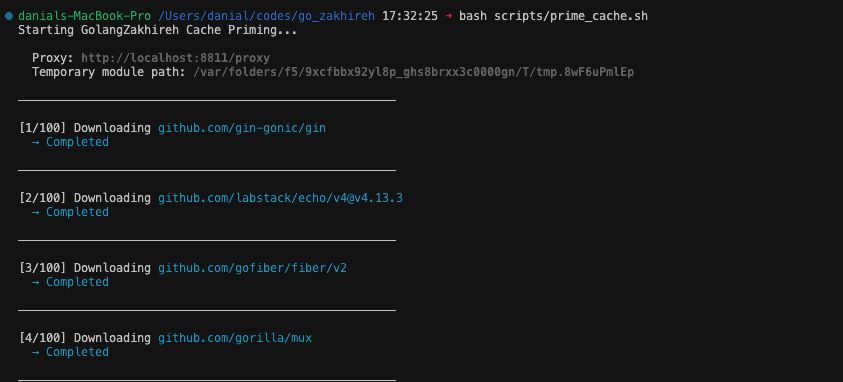
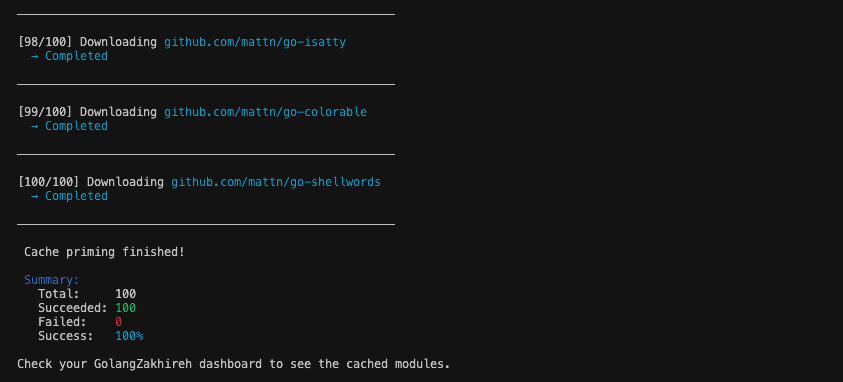
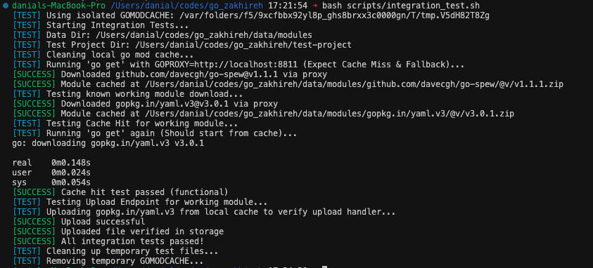

# How to Use GolangZakhireh

GolangZakhireh is a local Go module proxy that caches packages for offline use and faster builds. This guide will walk you through setting it up and using it in your development workflow.

---

## [.] Table of Contents

- [Quick Start](#quick-start)
- [Installation](#installation)
- [Configuration](#configuration)
- [Using GolangZakhireh](#using-golangzakhireh)
- [Advanced Usage](#advanced-usage)
- [Troubleshooting](#troubleshooting)

---

```text
   ____        _      __      _____ __             __ 
  / __ \__  __(_)____/ /__   / ___// /_____ ______/ /_
 / / / / / / / / ___/ //_/   \__ \/ __/ __ `/ ___/ __/
/ /_/ / /_/ / / /__/ ,<     ___/ / /_/ /_/ / /  / /_  
\___\_\__,_/_/\___/_/|_|   /____/\__/\__,_/_/   \__/  
```

### 1. Start the Server

```bash
# Option A: Run directly with Go
go run ./cmd/server

# Option B: Build and run the binary
go build -o golangzakhireh ./cmd/server
./golangzakhireh

# Option C: Use Docker
docker-compose up -d
```

The server will start on `http://localhost:8811` by default.

### 2. Configure Your Go Environment

Set the `GOPROXY` environment variable to point to your local GolangZakhireh instance:

```bash
# Temporary (current shell session only)
export GOPROXY=http://localhost:8811/proxy,direct
export GOSUMDB=off  # Optional: disable checksum verification for testing
```

To make it permanent, add these lines to your shell profile (`~/.bashrc`, `~/.zshrc`, etc.):

```bash
echo 'export GOPROXY=http://localhost:8811/proxy,direct' >> ~/.zshrc
source ~/.zshrc
```

### 3. Download Modules

Now when you run `go get` or `go mod download`, modules will be cached through GolangZakhireh:

```bash
cd your-project
go get github.com/gin-gonic/gin
```

### 4. View the Dashboard

Open your browser and navigate to `http://localhost:8811`. You'll see all cached modules, their versions, and sizes.

---

```text
    ____           __        ____      __  _           
   /  _/___  _____/ /_____ _/ / /___ _/ /_(_)___  ____ 
   / // __ \/ ___/ __/ __ `/ / / __ `/ __/ / __ \/ __ \
 _/ // / / (__  ) /_/ /_/ / / / /_/ / /_/ / /_/ / / / /
/___/_/ /_/____/\__/\__,_/_/_/\__,_/\__/_/\____/_/ /_/ 
```

### Prerequisites

- **Go 1.22+** (for building from source)
- **Docker** (optional, for containerized deployment)

### From Source

```bash
# Clone the repository
git clone https://github.com/GolangZakhireh/golang_zakhireh.git
cd golang_zakhireh

# Build the binary
go build -o golangzakhireh ./cmd/server

# Run it
./golangzakhireh
```

### Using Docker

```bash
# Build and start with docker-compose
docker-compose up -d

# Or build manually
docker build -t golangzakhireh:latest .
docker run -p 8811:8811 -v ./data/modules:/data/modules golangzakhireh:latest
```

---

```text
   ______            _____                        __  _           
  / ____/___  ____  / __(_)___ ___  ___________ _/ /_(_)___  ____ 
 / /   / __ \/ __ \/ /_/ / __ `/ / / / ___/ __ `/ __/ / __ \/ __ \
/ /___/ /_/ / / / / __/ / /_/ / /_/ / /  / /_/ / /_/ / /_/ / / / /
\____/\____/_/ /_/_/ /_/\__, /\__,_/_/   \__,_/\__/_/\____/_/ /_/ 
                       /____/                                     
```

GolangZakhireh is configured via environment variables:

| Variable | Default | Description |
|:---|:---|:---|
| `GOLANGZAKHIREH_PORT` | `:8811` | Port to listen on |
| `GOLANGZAKHIREH_DATA_DIR` | `./data/modules` | Directory to store cached modules |
| `GOLANGZAKHIREH_UPSTREAM` | `https://proxy.golang.org` | Upstream proxy URL |
| `GONOSUMDB` | (empty) | Comma-separated patterns for private modules |
| `GOLANGZAKHIREH_ALLOW` | (empty) | Comma-separated list of allowed patterns |
| `GOLANGZAKHIREH_DENY` | (empty) | Comma-separated list of denied patterns |

### Example: Custom Configuration

```bash
export GOLANGZAKHIREH_PORT=:9000
export GOLANGZAKHIREH_DATA_DIR=/var/cache/go-modules
export GOLANGZAKHIREH_UPSTREAM=https://goproxy.io
export GONOSUMDB=github.com/mycompany/*
```

---

```text
   __  __                         ______      _     __   
  / / / /________ _____ ____     / ____/_  __(_)___/ /__ 
 / / / / ___/ __ `/ __ `/ _ \   / / __/ / / / / __  / _ \
/ /_/ (__  ) /_/ / /_/ /  __/  / /_/ / /_/ / / /_/ /  __/
\____/____/\__,_/\__, /\___/   \____/\__,_/_/\__,_/\___/ 
                /____/                                   
```

### Basic Workflow

1.  **Start GolangZakhireh server** (see Quick Start)
2.  **Configure your Go environment** to use the proxy
3.  **Use Go commands normally** - modules will be cached automatically

### Commands That Use the Proxy

All standard Go commands that download modules will use GolangZakhireh:

```bash
go get github.com/spf13/cobra
go mod download
go mod tidy
go build
go test
```

### Verifying It's Working

Check the dashboard at `http://localhost:8811` to see cached modules, or check the data directory:

```bash
ls -la ./data/modules/github.com/
```

---

```text
    ___       __                                __   __  __        
   /   | ____/ /   ______ _____  ________  ____/ /  / / / /_______ 
  / /| |/ __  / | / / __ `/ __ \/ ___/ _ \/ __  /  / / / / ___/ _ \
 / ___ / /_/ /| |/ / /_/ / / / / /__/  __/ /_/ /  / /_/ (__  )  __/
/_/  |_\__,_/ |___/\__,_/_/ /_/\___/\___/\__,_/   \____/____/\___/ 
```

### Priming the Cache

Use the included script to pre-download popular packages. This is useful for initializing a fresh installation.

```bash
./scripts/prime_cache.sh
```




*The priming script ensures common libraries are available immediately.*

### Private Modules

For private modules that shouldn't use checksum verification:

```bash
export GONOSUMDB=github.com/mycompany/*,gitlab.internal.com/*
```

### Access Control

**Allow only specific modules:**
```bash
export GOLANGZAKHIREH_ALLOW=github.com/myorg/*,golang.org/x/*
```

**Deny specific modules:**
```bash
export GOLANGZAKHIREH_DENY=github.com/malicious/*
```

### Manual Upload

Upload private modules manually via the `/upload` endpoint:

```bash
curl -X POST http://localhost:8811/upload \
  -F "module=github.com/mycompany/private" \
  -F "version=v1.0.0" \
  -F "info=@v1.0.0.info" \
  -F "mod=@v1.0.0.mod" \
  -F "zip=@v1.0.0.zip"
```

---

```text
  ______                 __    __          __                __ 
 /_  __/________  __  __/ /_  / /__  _____/ /_  ____  ____  / /_
  / / / ___/ __ \/ / / / __ \/ / _ \/ ___/ __ \/ __ \/ __ \/ __/
 / / / /  / /_/ / /_/ / /_/ / /  __(__  ) / / / /_/ / /_/ / /_  
/_/ /_/   \____/\__,_/_.___/_/\___/____/_/ /_/\____/\____/\__/
```

### Server Not Starting

**Check if port is already in use:**
```bash
lsof -i :8811
```

**Use a different port:**
```bash
export GOLANGZAKHIREH_PORT=:9000
./golangzakhireh
```

### Integration Test Failure

If you suspect something is wrong with the proxy logic, run the integration test suite:

```bash
./scripts/integration_test.sh
```



*The integration test verifies the full download and cache cycle.*

### Checksum Mismatch

If you see checksum errors with private modules:

```bash
export GOSUMDB=off
# Or for specific modules:
export GONOSUMDB=github.com/yourcompany/*
```

### Clear Cache

To clear all cached modules and start fresh:

```bash
./scripts/cleanup.sh
```

---

**[Back to README.md](README.md)**

<!-- 
ASCII ART GENERATION
====================
Regenerate these banners using the following commands:

- Project Banner: figlet -w 450 -f ~/codes/ANSI_Shadow.flf "Golang Zakhireh"
- Section Headers: figlet -f slant "Text Here"

Preserved for maintenance/regeneration of the documentation aesthetics.
-->
