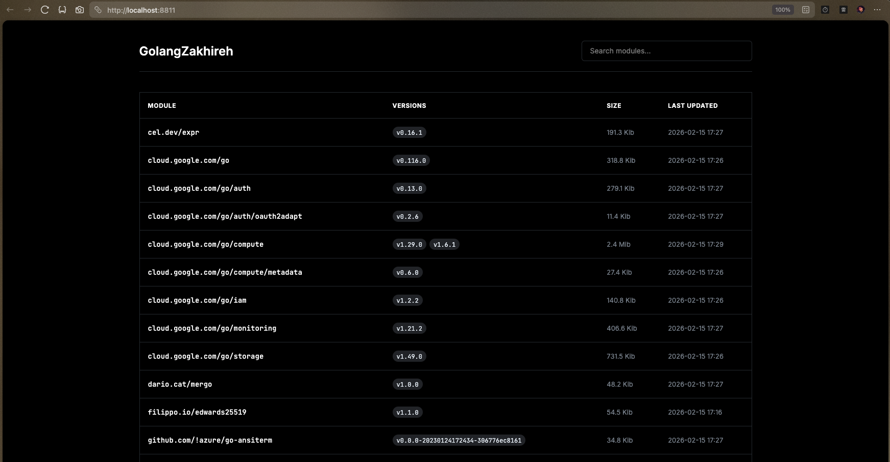
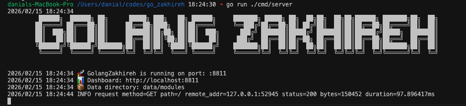

```text
	 ██████╗  ██████╗ ██╗      █████╗ ███╗   ██╗ ██████╗     ███████╗ █████╗ ██╗  ██╗██╗  ██╗██╗██████╗ ███████╗██╗  ██╗
	██╔════╝ ██╔═══██╗██║     ██╔══██╗████╗  ██║██╔════╝     ╚══███╔╝██╔══██╗██║ ██╔╝██║  ██║██║██╔══██╗██╔════╝██║  ██║
	██║  ███╗██║   ██║██║     ███████║██╔██╗ ██║██║  ███╗      ███╔╝ ███████║█████╔╝ ███████║██║██████╔╝█████╗  ███████║
	██║   ██║██║   ██║██║     ██╔══██║██║╚██╗██║██║   ██║     ███╔╝  ██╔══██║██╔═██╗ ██╔══██║██║██╔══██╗██╔══╝  ██╔══██║
	╚██████╔╝╚██████╔╝███████╗██║  ██║██║ ╚████║╚██████╔╝    ███████╗██║  ██║██║  ██╗██║  ██║██║██║  ██║███████╗██║  ██║
	 ╚═════╝  ╚═════╝ ╚══════╝╚═╝  ╚═╝╚═╝  ╚═══╝ ╚═════╝     ╚══════╝╚═╝  ╚═╝╚═╝  ╚═╝╚═╝  ╚═╝╚═╝╚═╝  ╚═╝╚══════╝╚═╝  ╚═╝   
```

GolangZakhireh is a robust, local Go module proxy designed for teams working in air-gapped or restricted environments. It caches modules locally and serves them to developers, ensuring reliable builds even when the upstream internet is unstable or inaccessible.

---

## [.] Features

*   **Offline Mode**: Serves cached modules without internet access.
*   **Module Upload**: Supports manual upload of private modules (`.zip`, `.mod`, `.info`).
*   **Dashboard**: Minimal Web UI to view cached modules, sizes, and versions.
*   **Private Modules**: Support for `GONOSUMDB` and allow/deny lists.

**[Read the complete How-To Guide](HOWTO.md)** for detailed setup and usage instructions.

---

## [.] Dashboard



*The minimalist grayscale dashboard provides a clear overview of your cached modules.*

---

## [.] Getting Started

### Running Locally

1.  **Start the server:**
    ```bash
    go run ./cmd/server
    ```
    The server listens on `:8811` by default.

    

2.  **Configure your Go environment:**
    ```bash
    export GOPROXY=http://localhost:8811/proxy,direct
    ```

3.  **Download modules:**
    Simply run `go get` or `go mod download` in your projects. GolangZakhireh will cache them.

4.  **View Dashboard:**
    Open [http://localhost:8811](http://localhost:8811) in your browser.

### Running with Docker

```bash
docker-compose up -d
```
This will start GolangZakhireh and mount `./data/modules` for persistence.

---

## [.] Configuration

Configuration is managed via environment variables:

| Variable | Default | Description |
|:---|:---|:---|
| `GOLANGZAKHIREH_PORT` | `:8811` | Port to listen on. |
| `GOLANGZAKHIREH_DATA_DIR` | `./data/modules` | Directory to store cached modules. |
| `GOLANGZAKHIREH_UPSTREAM` | `https://proxy.golang.org` | Upstream proxy URL. |
| `GONOSUMDB` | (empty) | Comma-separated glob patterns for private modules. |
| `GOLANGZAKHIREH_ALLOW` | (empty) | Comma-separated list of allowed module patterns. |
| `GOLANGZAKHIREH_DENY` | (empty) | Comma-separated list of denied module patterns. |

---

## [.] Testing & Maintenance

### Testing
Run unit tests:
```bash
go test ./...
```

Run integration tests (requires server running):
```bash
./scripts/integration_test.sh
```

### Cleanup
To remove all cached data and logs:
```bash
./scripts/cleanup.sh
```

---

## [.] Alternatives & Motivation

While mature solutions like [GoMods.io](https://docs.gomods.io/) and [Athens](https://github.com/gomods/athens) exist and are excellent for many use cases, GolangZakhireh was built with a different philosophy in mind:

*   **Extreme Simplicity**: A single-binary solution that just works without complex setup or heavy dependencies.
*   **Lightweight & Minimal**: Designed to run efficiently even on low-resource machines in air-gapped environments.
*   **Hackability**: A clean, modular codebase using standard Go patterns, making it remarkably easy for anyone to read, edit, and tailor to their specific infrastructure needs.

---

## [.] License

MIT

<!-- 
ASCII ART GENERATION
====================
Regenerate these banners using the following commands:

- Project Banner: figlet -w 450 -f ~/codes/ANSI_Shadow.flf "Golang Zakhireh"
- Section Headers: figlet -f slant "Text Here"

Preserved for maintenance/regeneration of the documentation aesthetics.
-->
